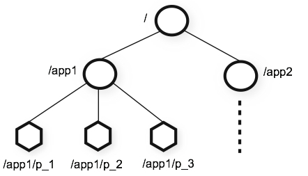

## ZooKeeper: 用于分布式应用的分布式协调服务 ##
Zookeeper是一个用于分布式应用上的分布式的、开源的协调服务。它暴露一组简单的组件，在此之上，分布式应用可以实现更高层次的服务，如同步、配置管理、分组和命名等。它被设计得易于开发，并且使用的数据模型也是基于熟识的文件系统的树形结构。运行在Java上，并且与Java和C绑定在一起。

众所周知，分布式服务很难保证正确性。特别易于出现竟态条件或是死锁这样的错误。Zookeeper背后的动机就是，减轻分布式系统从0开始实现协调服务的重担。

## 设计目标 ##

**简单** Zookeeper允许分布式进程之间通过一个共享的命名空间协作交互。这个命名空间和标准的文件系统非常类似。命名空间里包含了注册的数据项，在Zookeeper术语上称为节点。这和文件系统很相似。但区别在于，典型的文件系统是基于存储设计的，Zookeeper的数据都保存在内存里。这意味着，Zookeeper可以获得高吞吐、低延迟。

Zookeeper实现时,花了很多精力在高性能、高可用和严格的存取顺序上。高性能意味着Zookeeper可以用在大规模的分布式系统里。可靠性意味着可以避免单点故障。严格的循序控制意味着，客户端可以实现复杂的同步原语。

***冗余*** 就像是协作的分布式进程，Zookeeper自己也会冗余一组服务器,称作ensemble。(TODO看过代码回头再检查下)

Zookeeper内的服务器之间必须要互相知道对方。他们维护一个状态的内存镜像，事务日志，持久化快照。只要多数服务器可用，Zookeeper服务就可用。

Zookeeper内的服务器之间必须要互相知道对方。他们维护一个状态的内存镜像，事务日志，持久化快照。只要多数服务器可用，Zookeeper服务就可用。

客户端链接一台服务器，客户端维护一个TCP链接，通过这个链接，发送请求，获得响应，监听事件，发送心跳。如果TCP链接断掉了，客户端会链接到其他服务上。

***Zookeeper是有序的。*** Zookeeper为每一个update打了一个邮戳，用来反映Zookeeper事务的顺序。后续的操作利用顺序实现更高层次的抽象，比如同步原语。

Zookeeper很快。尤其是在读占多数时。Zookeeper运行在上千个服务器上时，读写比达到10：1性能最优越。

## 数据模型和层级命名空间 ##
Zookeeper的命名空间非常像标准的文件系统。一个命名就是有slash分割的路径。Zookeeper的每一个节点的命名空间就由一个路径来标识。

***节点和临时节点***
和标准的文件系统不同的是，每一个节点都可以有数据和子节点。就像是说一个文件系统里，文件也是文件夹。(Zookeeper会存储这些数据：状态、配置、位置信息等，所以存在每一个节点的数据通常都比较小，KB范围内。)我们使用术语znode来描述我们Zookeeper的数据节点。

Znode里有一个结构体stat。包含了version(数据、ACL变动次数)、时间戳，方便缓存校验和更新。当数据变动时，version递增。例如，当客户端获得数据的同时，也获得了数据的version。

数据的存取都是原子性的。全部读，全部替换。每个节点有个ACL来限制谁有权限做什么。
Zookeeper有个临时节点的概念。当创建这个节点的session处于活跃状态，这样的节点就存在着。当session结束了，节点也就被删除掉了。如果要实现tbd,临时节点很有用。

***条件更新和监听***
Zookeeper支持监听的概念。客户端可以监听一个节点。当接单发生变化时，监听被触发，并且被移除掉。当监听被触发时，客户端接收到一个包，内容是某个节点发生了变化。当客户端和服务器端的链接断掉了，客户端会接到一个本地通知。这些可以在tbd中使用。

***保障***
Zookeeper既快又简单。尽管Zookeeper的目标是作为构建像是同步这样复杂服务的基础，Zookeeper提供了多重保障。比如：

顺序一致性：客户端的updates，保证生效按照发出的顺序。
原子性：成功或失败，没有部分结果。
单一系统镜像：客户端无论链接到哪个服务器，看到的结果都是一样的。
可靠性: 当一个更新成功后，从这个时间开始，直到覆盖此更新，做持久化。
及时性: 在某个时间范围内，客户端看到的镜像保障是最新的。
更多信息，以及如何使用，参见tbd。

***简单的API***
Zookeeper的一个设计目标是提供一个非常简单的编程接口。所以，只提供了下面这些操作：
create : 在树的某个位置创建节点。
delete : 删除节点。
exists : 检查在某个位置是否存在节点。
get data : 从节点获取内容。
set data : 写内容到节点。
get children : 获得某个节点的子节点集合。
sync : 等待广播数据。
更多深层次讨论，以及如何用这些来实现更高层次的操作，参见 [tbd]

***实现***
Zookeeper组件图展示出了Zookeeper服务中更高层次的组件。除了请求处理器,每个组件，对于每个Zookeeper服务器都有自己一套拷贝。

拷贝的数据库是个内存数据库，包含了整个树。所有的更新都会记录在硬盘上，保障可恢复性。写操作在应用到内存之前先序列化到硬盘上。

所有的Zookeeper服务器为客户端提供服务。客户端链接精确链接到一台服务器上提交请求。对于读请求，每个server端的数据库拷贝提供服务。改变服务状态的请求，也就是写请求，是通过一致性协议处理。

作为协议的一部分，所有的写请求都被转发到同一个服务器上，被称为leader。其他的服务器，称为followeres，接受来自leader的提案,同意消息传递。消息层面负责当leader失败时替换leader，以及同步follower和leader。

Zookeeper使用一个自定义的原子的消息协议。由于消息层面的原子性，Zookeeper可以保障本地复制不会偏差。leader接收到写请求后，计算系统的状态，并转换成一个事务，这个事务里封装了新的状态。

***使用***
zookeeper的接口非常精简。不过，使用这些接口，可以实现更高层次的操作，比如同步原语、组成员、所有权等。有些分布式系统已经使用了:[tbd:]更多信息,参考[tbd]

***性能***
Zookeeper被设计成高性能的。但是，真相呢？Yahoo的Zookeeper开发团队的研究结果表明这是真的。(查看Zookeeper不同读写比的吞吐量。) 在读远大于写的场景中，是非常地高性能,因为写操作包含了所有服务器之间状态的同步。(读远高于写是分布式服务的典型场景。)

图Zookeeper不同读写比下的吞吐量,是使用的Zookeeper 3.2版本的吞吐量图。Zookeeper运行在2Ghz的Xeon处理器和2个SATA 15K RPM硬盘上。1个硬盘用专门用来作为zookeeper的日志硬盘。快照落地到系统硬盘里。读、写的大小都是1k。"服务器"表示zookeeper集群服务器的数量，这些服务器共同提供服务。约30个其他的服务器用来模拟客户端。zookeeper集群配置，leader不接受客户端的连接。

基准也表示出可靠性。图"出现异常时的可靠性"，显示出了部署节点如何应对各种失败。图中标记出的事件是：

1、1个follower失败和恢复。
2、另外一个follower失败和恢复。
3、leader失败。
4、2个follower失败和恢复。
5、另外一个leader失败。

可靠性
为了展示当错误引入时，系统随着时间的表现。我们运行了一组包含7台服务器的zookeeper服务。

Reliability
To show the behavior of the system over time as failures are injected we ran a ZooKeeper service made up of 7 machines. We ran the same saturation benchmark as before, but this time we kept the write percentage at a constant 30%, which is a conservative ratio of our expected workloads.

[原文](http://zookeeper.apache.org/doc/r3.4.8/zookeeperOver.html)
`本站独自翻译，转载请注明出处`