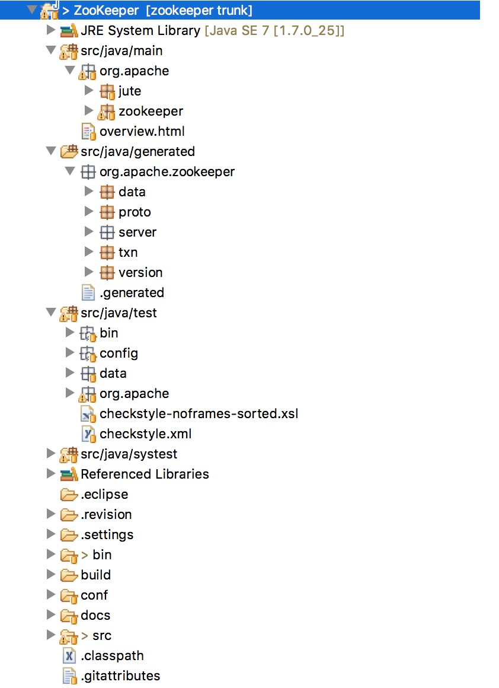
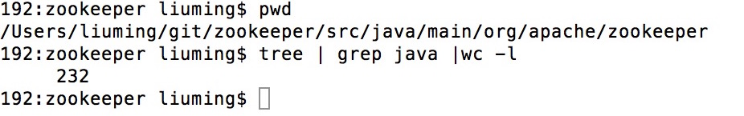

**1.** 可以从<a href="https://github.com/apache/zookeeper">github</a>上直接clone下来,当然我们以学习为主，可能会做些笔记，建议`Fork`一下，从自己的仓库clone。
	```	bash
	git clone https://github.com/ming-liu/zookeeper.git 
	```
**2.** 安装ant [Ant下载](http://ant.apache.org/bindownload.cgi)  [Ant手册](http://ant.apache.org/manual/index.html)

**3.** 生成eclipse项目
	```
	ant eclipse
	```
**4.** 导入eclipse
	```bash
	import->General->Existing Projects in Workspace
	导入之后，通常会有很多编译错误，特别要注意，一定要使用JDK1.7以上版本。检查下.settings/org.eclipse.jdt.core.prefs，里面有6.0/1.6的全部替换成1.7。
	```
**5.** 先概览下包结构
	
**6.** 读源码思路。大概先浏览下包里的内容，核心代码应该在`org.apache.zookeeper`下。那接下来就逐个击破吧，看看这个包下有多少个java类。
	